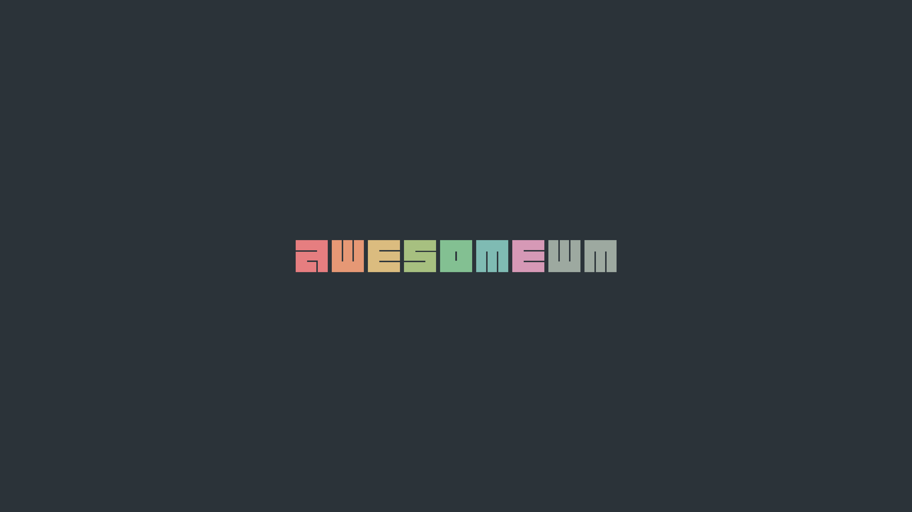
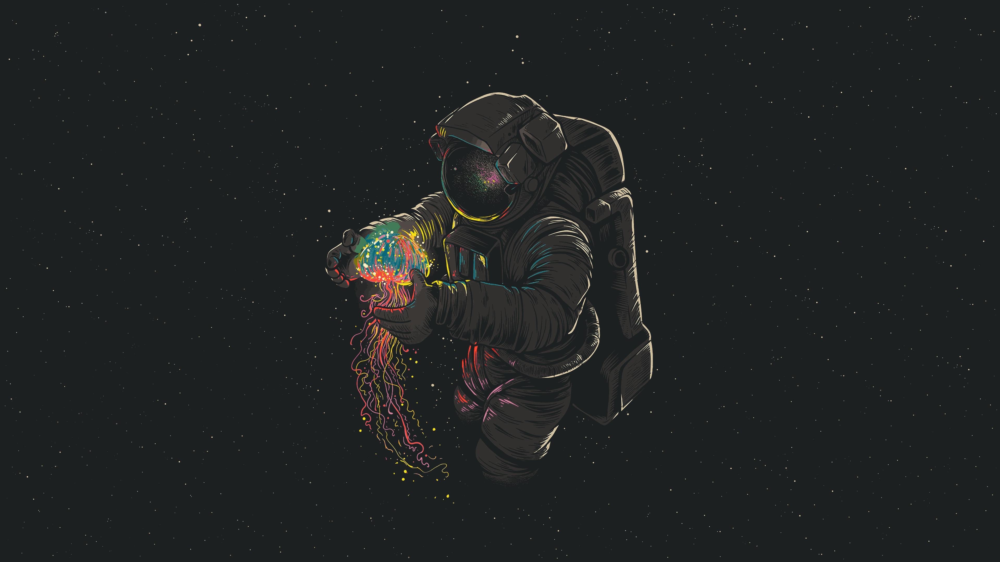
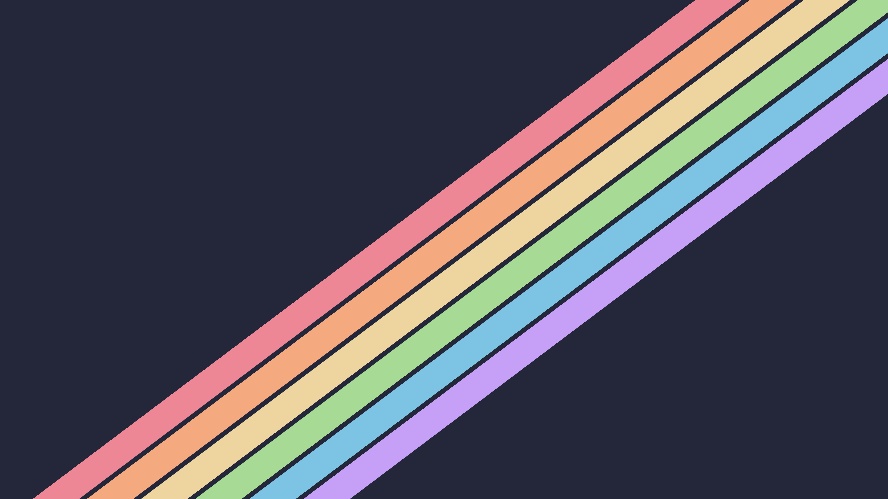
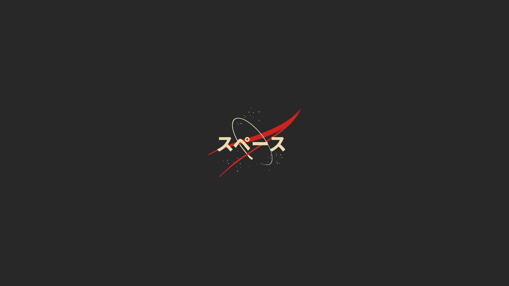

# 4K Wallpapers Collection 🖼️

A curated collection of stunning 4K wallpapers (3840x2160) perfect for desktop backgrounds and high-resolution displays.

[](#)
[-green.svg)](#)
[](#)
[](#)

## 🖼️ Wallpaper Preview Gallery

*All wallpapers are located in the `wallpapers/` directory*

<table>
<tr>
<td align="center" width="50%">

<br><strong>wallpaper_01.png</strong>
<br><em>Tech Theme • PNG Format</em>
</td>
<td align="center" width="50%">

<br><strong>wallpaper_02.png</strong>
<br><em>Tech Theme • PNG Format</em>
</td>
</tr>
<tr>
<td align="center" width="50%">

<br><strong>wallpaper_03.png</strong>
<br><em>Minimalist • PNG Format</em>
</td>
<td align="center" width="50%">

<br><strong>wallpaper_04.png</strong>
<br><em>Minimalist • PNG Format</em>
</td>
</tr>
<tr>
<td align="center" width="50%">

<br><strong>wallpaper_05.png</strong>
<br><em>Tech Branding • PNG Format</em>
</td>
<td align="center" width="50%">

<br><strong>wallpaper_06.png</strong>
<br><em>OS Theme • PNG Format</em>
</td>
</tr>
<tr>
<td align="center" width="50%">

<br><strong>wallpaper_07.png</strong>
<br><em>Linux Theme • PNG Format</em>
</td>
<td align="center" width="50%">

<br><strong>wallpaper_08.png</strong>
<br><em>OS Branding • PNG Format</em>
</td>
</tr>
<tr>
<td align="center" width="50%">

<br><strong>wallpaper_09.png</strong>
<br><em>Clean Design • PNG Format</em>
</td>
<td align="center" width="50%">

<br><strong>wallpaper_10.jpg</strong>
<br><em>High Quality • JPEG Format</em>
</td>
</tr>
<tr>
<td align="center" width="50%">

<br><strong>wallpaper_11.jpg</strong>
<br><em>Photography • JPEG Format</em>
</td>
<td align="center" width="50%">

<br><strong>wallpaper_12.jpg</strong>
<br><em>Abstract Art • JPEG Format</em>
</td>
</tr>
<tr>
<td align="center" width="50%">

<br><strong>wallpaper_13.png</strong>
<br><em>Color Theme • PNG Format</em>
</td>
<td align="center" width="50%">

<br><strong>wallpaper_14.png</strong>
<br><em>Color Theme • PNG Format</em>
</td>
</tr>
<tr>
<td align="center" width="50%">

<br><strong>wallpaper_15.png</strong>
<br><em>Vibrant • PNG Format</em>
</td>
<td align="center" width="50%">

<br><strong>wallpaper_16.png</strong>
<br><em>Theme Collection • PNG Format</em>
</td>
</tr>
<tr>
<td align="center" width="50%">

<br><strong>wallpaper_17.png</strong>
<br><em>Window Manager • PNG Format</em>
</td>
<td align="center" width="50%">

<br><strong>wallpaper_18.png</strong>
<br><em>Desktop Theme • PNG Format</em>
</td>
</tr>
<tr>
<td align="center" width="50%">

<br><strong>wallpaper_19.png</strong>
<br><em>Custom Theme • PNG Format</em>
</td>
<td align="center" width="50%">

<br><strong>wallpaper_20.png</strong>
<br><em>Color Palette • PNG Format</em>
</td>
</tr>
<tr>
<td align="center" width="50%">

<br><strong>wallpaper_21.png</strong>
<br><em>OS Distribution • PNG Format</em>
</td>
<td align="center" width="50%">

<br><strong>wallpaper_22.png</strong>
<br><em>Portrait Style • PNG Format</em>
</td>
</tr>
<tr>
<td align="center" width="50%">

<br><strong>wallpaper_23.jpg</strong>
<br><em>Browser Theme • JPEG Format</em>
</td>
<td align="center" width="50%">

<br><strong>wallpaper_24.jpg</strong>
<br><em>Nature Scene • JPEG Format</em>
</td>
</tr>
<tr>
<td align="center" width="50%">

<br><strong>wallpaper_25.png</strong>
<br><em>Astronomical • PNG Format</em>
</td>
<td align="center" width="50%">

<br><strong>wallpaper_26.png</strong>
<br><em>Abstract Design • PNG Format</em>
</td>
</tr>
<tr>
<td align="center" width="50%">

<br><strong>wallpaper_27.png</strong>
<br><em>Warning Design • PNG Format</em>
</td>
<td align="center" width="50%">

<br><strong>wallpaper_28.png</strong>
<br><em>DevOps Theme • PNG Format</em>
</td>
</tr>
<tr>
<td align="center" width="50%">

<br><strong>wallpaper_29.png</strong>
<br><em>Container Tech • PNG Format</em>
</td>
<td align="center" width="50%">

<br><strong>wallpaper_30.png</strong>
<br><em>Theme Collection • PNG Format</em>
</td>
</tr>
<tr>
<td align="center" colspan="2">
<h3>🌈 Premium Textured Collection</h3>
<em>High-resolution wallpapers with artistic textures</em>
</td>
</tr>
<tr>
<td align="center" width="50%">

<br><strong>wallpaper_31.png</strong>
<br><em>Textured Theme • 15.6MB</em>
</td>
<td align="center" width="50%">

<br><strong>wallpaper_32.png</strong>
<br><em>Textured Variant • 14.0MB</em>
</td>
</tr>
<tr>
<td align="center" width="50%">

<br><strong>wallpaper_33.png</strong>
<br><em>Dark Theme • PNG Format</em>
</td>
<td align="center" width="50%">

<br><strong>wallpaper_34.png</strong>
<br><em>Premium Texture • 13.4MB</em>
</td>
</tr>
<tr>
<td align="center" width="50%">

<br><strong>wallpaper_35.png</strong>
<br><em>Forest Theme • PNG Format</em>
</td>
<td align="center" width="50%">

<br><strong>wallpaper_36.png</strong>
<br><em>Forest Texture • 15.0MB</em>
</td>
</tr>
<tr>
<td align="center" width="50%">

<br><strong>wallpaper_37.png</strong>
<br><em>Warm Theme • PNG Format</em>
</td>
<td align="center" width="50%">

<br><strong>wallpaper_38.png</strong>
<br><em>Warm Texture • 9.9MB</em>
</td>
</tr>
<tr>
<td align="center" width="50%">

<br><strong>wallpaper_39.png</strong>
<br><em>Light Variant • PNG Format</em>
</td>
<td align="center" width="50%">

<br><strong>wallpaper_40.png</strong>
<br><em>Light Texture • 19.1MB</em>
</td>
</tr>
<tr>
<td align="center" width="50%">

<br><strong>wallpaper_41.png</strong>
<br><em>Nordic Style • PNG Format</em>
</td>
<td align="center" width="50%">

<br><strong>wallpaper_42.png</strong>
<br><em>Nordic Texture • 15.7MB</em>
</td>
</tr>
<tr>
<td align="center" width="50%">

<br><strong>wallpaper_43.png</strong>
<br><em>Cool Stripes • PNG Format</em>
</td>
<td align="center" width="50%">

<br><strong>wallpaper_44.png</strong>
<br><em>Cool Texture • 20.2MB</em>
</td>
</tr>
<tr>
<td align="center" width="50%">

<br><strong>wallpaper_45.png</strong>
<br><em>6-Stripe Design • PNG Format</em>
</td>
<td align="center" width="50%">

<br><strong>wallpaper_46.png</strong>
<br><em>6-Stripe Texture • 16.0MB</em>
</td>
</tr>
<tr>
<td align="center" width="50%">

<br><strong>wallpaper_47.png</strong>
<br><em>Light Stripes • PNG Format</em>
</td>
<td align="center" width="50%">

<br><strong>wallpaper_48.png</strong>
<br><em>Light Texture • 20.6MB</em>
</td>
</tr>
<tr>
<td align="center" colspan="2">
<h3>📸 Photography & Landscapes</h3>
<em>High-quality photography and scenic views</em>
</td>
</tr>
<tr>
<td align="center" width="50%">

<br><strong>wallpaper_49.png</strong>
<br><em>Scenic View • PNG Format</em>
</td>
<td align="center" width="50%">

<br><strong>wallpaper_50.jpg</strong>
<br><em>Clean Design • JPEG Format</em>
</td>
</tr>
<tr>
<td align="center" width="50%">

<br><strong>wallpaper_51.jpg</strong>
<br><em>Gaming Theme • JPEG Format</em>
</td>
<td align="center" width="50%">

<br><strong>wallpaper_52.jpg</strong>
<br><em>Entertainment • JPEG Format</em>
</td>
</tr>
<tr>
<td align="center" width="50%">

<br><strong>wallpaper_53.jpg</strong>
<br><em>Nature Photography • JPEG Format</em>
</td>
<td align="center" width="50%">

<br><strong>wallpaper_54.png</strong>
<br><em>Portrait Style • PNG Format</em>
</td>
</tr>
<tr>
<td align="center" width="50%">

<br><strong>wallpaper_55.png</strong>
<br><em>Modern Abstract • PNG Format</em>
</td>
<td align="center" width="50%">

<br><strong>wallpaper_56.png</strong>
<br><em>Tech Abstract • PNG Format</em>
</td>
</tr>
<tr>
<td align="center" width="50%">

<br><strong>wallpaper_57.png</strong>
<br><em>Contemporary • PNG Format</em>
</td>
<td align="center" width="50%">

<br><strong>wallpaper_58.png</strong>
<br><em>Landscape View • PNG Format</em>
</td>
</tr>
<tr>
<td align="center" colspan="2">
<h3>🚀 Extended Collection</h3>
<em>Additional high-quality wallpapers for every style</em>
</td>
</tr>
<tr>
<td align="center" width="50%">

<br><strong>wallpaper_59.png</strong>
<br><em>Digital Art • PNG Format</em>
</td>
<td align="center" width="50%">

<br><strong>wallpaper_60.png</strong>
<br><em>Geometric • PNG Format</em>
</td>
</tr>
<tr>
<td align="center" width="50%">

<br><strong>wallpaper_61.png</strong>
<br><em>Abstract Waves • PNG Format</em>
</td>
<td align="center" width="50%">

<br><strong>wallpaper_62.png</strong>
<br><em>Color Gradient • PNG Format</em>
</td>
</tr>
<tr>
<td align="center" width="50%">

<br><strong>wallpaper_63.png</strong>
<br><em>Modern Design • PNG Format</em>
</td>
<td align="center" width="50%">

<br><strong>wallpaper_64.jpg</strong>
<br><em>Professional Photo • JPEG Format</em>
</td>
</tr>
<tr>
<td align="center" width="50%">

<br><strong>wallpaper_65.png</strong>
<br><em>Artistic Style • PNG Format</em>
</td>
<td align="center" width="50%">

<br><strong>wallpaper_66.png</strong>
<br><em>Creative Design • PNG Format</em>
</td>
</tr>
<tr>
<td align="center" width="50%">

<br><strong>wallpaper_67.png</strong>
<br><em>Futuristic • PNG Format</em>
</td>
<td align="center" width="50%">

<br><strong>wallpaper_68.png</strong>
<br><em>Tech Innovation • PNG Format</em>
</td>
</tr>
<tr>
<td align="center" width="50%">

<br><strong>wallpaper_69.png</strong>
<br><em>Digital Future • PNG Format</em>
</td>
<td align="center" width="50%">

<br><strong>wallpaper_70.png</strong>
<br><em>Cyberpunk Style • PNG Format</em>
</td>
</tr>
<tr>
<td align="center" width="50%">

<br><strong>wallpaper_71.png</strong>
<br><em>Neon Aesthetic • PNG Format</em>
</td>
<td align="center" width="50%">

<br><strong>wallpaper_72.png</strong>
<br><em>Matrix Style • PNG Format</em>
</td>
</tr>
<tr>
<td align="center" width="50%">

<br><strong>wallpaper_73.png</strong>
<br><em>Digital Matrix • PNG Format</em>
</td>
<td align="center" width="50%">

<br><strong>wallpaper_74.png</strong>
<br><em>Code Aesthetic • PNG Format</em>
</td>
</tr>
<tr>
<td align="center" width="50%">

<br><strong>wallpaper_75.png</strong>
<br><em>Programming Theme • PNG Format</em>
</td>
<td align="center" width="50%">

<br><strong>wallpaper_76.png</strong>
<br><em>Developer Style • PNG Format</em>
</td>
</tr>
</table>

### 📁 Directory Structure
```
4k/
├── README.md
└── wallpapers/
    ├── wallpaper_01.png
    ├── wallpaper_02.png
    ├── ...
    └── wallpaper_76.png
```

---

## ⚖️ Legal Disclaimer & Usage Terms

### 📋 **IMPORTANT DISCLAIMER**

**This collection is provided for educational and personal use only. Please read the following terms carefully:**

### ✅ **Permitted Uses**
- ✅ **Personal desktop wallpapers** on your own devices
- ✅ **Private/personal use** in non-commercial settings
- ✅ **Educational purposes** and learning
- ✅ **Personal portfolio** or showcase (with attribution)

### ❌ **Prohibited Uses**
- ❌ **Commercial use** or monetization in any form
- ❌ **Redistribution** without explicit permission
- ❌ **Selling** or licensing to third parties
- ❌ **Claiming ownership** of the wallpapers
- ❌ **Using in commercial products** or services
- ❌ **Mass distribution** on other platforms

---

**Enjoy your new 4K desktop experience!** 🚀

*Collection curated for high-resolution displays | Last updated: August 2025*
